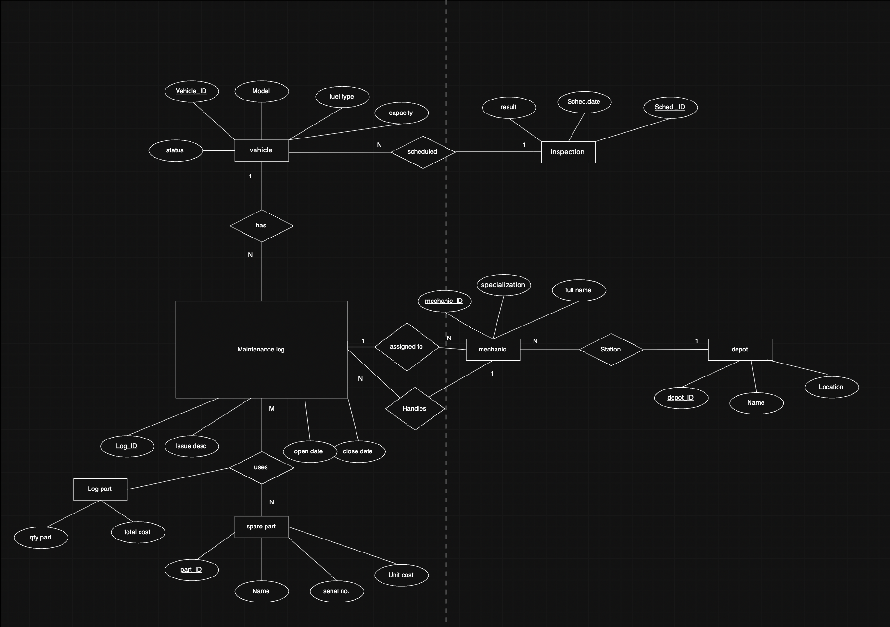

# Urban Fleet & Maintenance Hub

A desktop app (C# WinForms) for managing a vehicle fleet — vehicles, mechanics, maintenance logs, spare parts, and inspections, all backed by a SQL Server database.

Built as a database systems project, focused on relational schema design (7 entities, proper normalization) with a working front-end on top.

## What it does

- Add, update, and delete vehicles and mechanics
- Track maintenance logs and close them out when work is done
- Run 6 analytical queries — like finding the vehicle that needed the most repairs last month, or which mechanic closed the most tasks

## Entity diagram

## How to run it

1. Install Visual Studio (with the ".NET desktop development" workload) and SQL Server Express
2. Run `schema.sql` in SQL Server Management Studio to create the database
3. Open `TransportDB_GUI.sln`, restore NuGet packages, hit F5

If your SQL Server instance isn't named `SQLEXPRESS`, open any form's `.cs` file and update the `connectionString` at the top to match your instance name.

## Built with

C# · WinForms (.NET Framework 4.7.2) · SQL Server · ADO.NET
